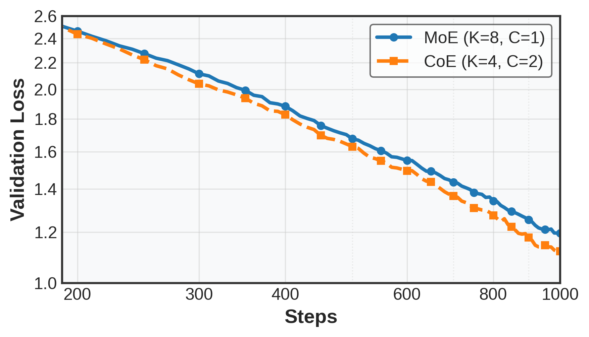
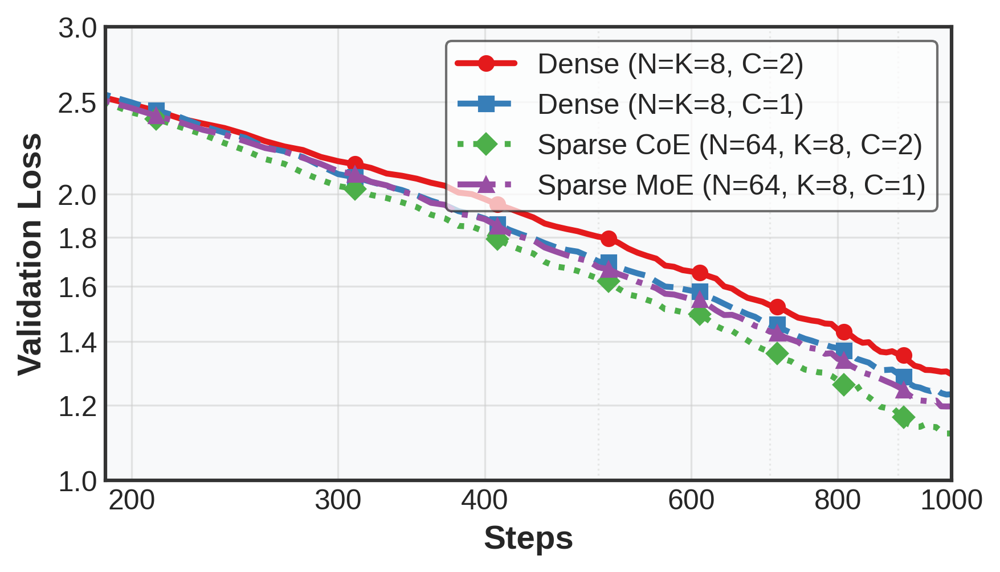
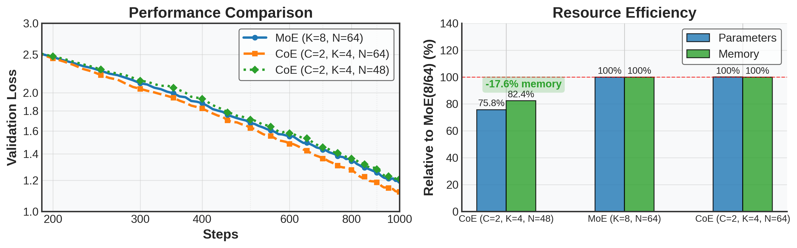
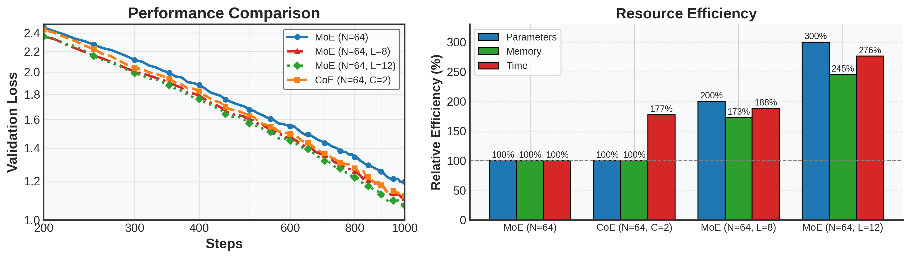
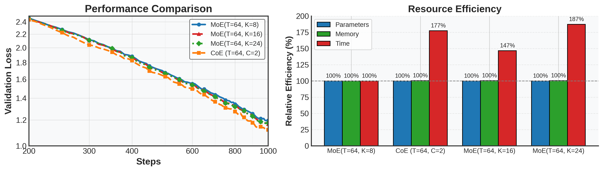
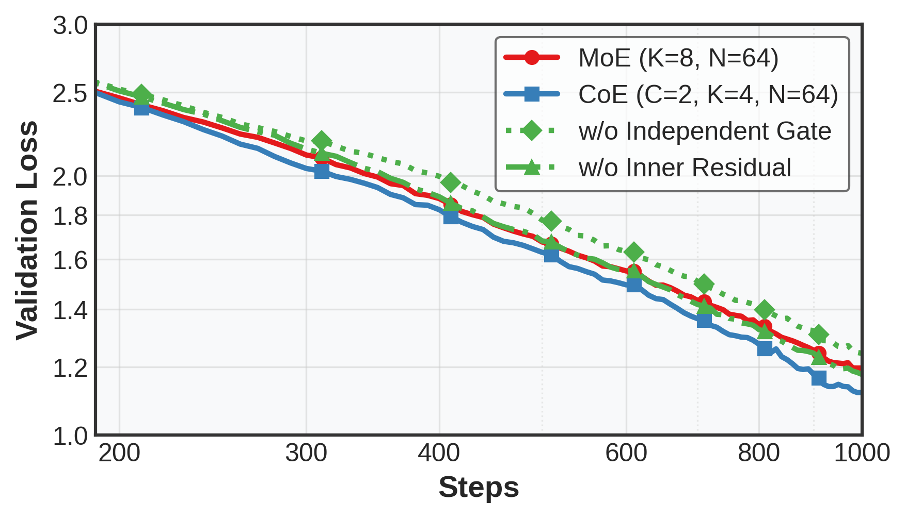

# Chain-of-Experts: Unlocking the Communication Power of MoEs
<p align="center">
  <a href="https://arxiv.org/abs/2506.18945"></a>
  <a href="https://x.com/wzihanw/status/1896601518612021709"></a>
 <a href="https://www.github.com/ZihanWang314/coe"></a>
</p>

## Introduction

We propose Chain-of-Experts (CoE), which fundamentally changes **sparse** Large Language Model (LLM) processing by implementing **sequential communication** between intra-layer experts within Mixture-of-Experts (MoE) models.

Mixture-of-Experts (MoE) models process information **independently in parallel** between experts and have **high memory requirements**. CoE introduces an **iterative mechanism enabling experts to "communicate"** by processing tokens on top of outputs from other experts.

**Experiments show that CoE significantly outperforms previous MoE models in multiple aspects:**

- **Performance:** CoE with **2x** iterations reduces Math validation loss **from 1.20 to 1.12**
- **Scaling: 2x** iterations matches performance of **3x** expert selections, outperforming layer scaling
- **Efficiency: 17.6%** lower memory usage with equivalent performance
- **Flexibility:** **823x** increase in expert combinations, improving utilization, communication, and specialization

These advantages constitute a "free lunch" effect, enabling efficient scaling of LLMs.

Paper (latest): **https://arxiv.org/abs/2506.18945**

Code: **https://github.com/ZihanWang314/coe**

English Blog (v0.1): [**Chain-of-Experts: Unlocking the Communication Power of MoEs**](https://www.notion.so/Chain-of-Experts-Unlocking-the-Communication-Power-of-MoEs-1ab9bb750b7980048d43e6aab3537cea?pvs=21)

Chinese Blog (v0.1): [**Chain-of-Experts: 释放MoE专家的沟通潜能**](https://www.notion.so/Chain-of-Experts-MoE-1ab9bb750b79801bbfebf01ae9a77b3f?pvs=21)

## Chain-of-Experts: Unlocking the Communication Power of MoE models

Large Language Models (LLMs) continue to push the boundaries of artificial intelligence possibilities, but **efficiently scaling** these models remains a major challenge. **Mixture of Experts (MoE)** models have emerged as a promising approach to address this challenge by activating only a portion of parameters for each token, theoretically achieving more efficient scaling. However, MoE models have the following limitations:

1. **Independent token processing**: MoE models typically process tokens in parallel and independently, with **limited communication between experts**.
2. **Low memory efficiency**: Due to sparse activation patterns, MoE models have a larger total parameter amount and require **substantial GPU memory resources**.

Our research introduces Chain-of-Experts (CoE), a new approach that innovates how sparse neural networks process information. See [our paper]((https://arxiv.org/abs/2506.18945)) for more details.


## Environment Setup
```bash
bash scripts/setup.sh # setting up environment
```
## running experiments
```bash
bash runs/run_latest.sh # run the basic experiments
```


## Experimental Guidelines

We adopted the DeepSeekV2 structure and conducted a series of experiments with a 500M-level MoE using a 32K token batch size trained for 1000 steps to validate CoE's effectiveness. A single training run uses one H100 for about 30 minutes or one 4090 for about 2 hours. More experimental details follow.

Our experimental method is named as ${\rm\{CoE/MoE\}} (C, K, N)$, for example, **CoE (C=2, K=4, N=64) represents using CoE with 2 iteration cycles, selecting 4 experts each time, with a total of 64 experts per layer.**

### Performance Advantages:

#### With similar compute and memory budgets, CoE clearly outperforms traditional approaches.

In pretraining on Math tasks (1000 steps), CoE (C=2, K=4, N=64) significantly outperforms MoE(K=8, N=64), **reducing loss from 1.20 to 1.12 with a steeper downward trend with similar compute and memory budget.** 



To run this experiment, please directly run `bash runs/run.sh`

We further evaluate CoE on “dense” (choose 8 in 8 experts) models, demonstrating that Recurrent Processing are more effective on Sparse MoE than on Dense models, and **CoE is a Sparse MoE-specific method that works effectively with Fine-Grained Sparse MoE models. As shown in the figure, recurrent for 2 times are no benefits to the Dense model.**



### Resource Efficiency

#### 1. With similar computation, CoE reduces memory requirements.

As shown below, CoE (C=2, K=4, N=48) achieves performance similar to MoE (K=8, N=64) but uses fewer total experts. **Under matched loss conditions, memory requirements are reduced by 18%.**




(note: we recorded the GPU memory allocated, related to the theoretical minimum memory with micro_bsz=1; in practice, memory usage is higher due to the large batch size used in experiments)

#### 2. With similar budget, CoE serves as a better scaling approach.

**We compared CoE with other computational scaling methods: expanding model layers and expanding expert selection count.**

#### *a) Expanding iteration count (CoE) > Expanding model layers*

We evaluated CoE (C=2, K=8, N=64), 4 layers vs MoE (K=8, N=64), 8  or 12 layers - the latter with 8 layers matches CoE performance but **has higher Memory requirements.**




#### *b) Expanding iteration count (CoE) > Expanding expert selection count*

CoE (C=2, K=8, N=64), 4 layers vs MoE (K=16, N=64) orMoE (K=24, N=64), 4 layers - **Memory and Compute requirements are consistent, but CoE performs better than scaling expert selection count.**




#### 3. Key Architectural Findings

**a. Independent gating mechanism**

Independent gating mechanisms can enhance model performance and to some extent explain expert specialization, indicating that similar expert processes different types of information at different iteration stages.

We implemented a CoE variant with shared gating. We found performance worse than CoE and even worse than non-scaled MoE, as shown in the figure, demonstrating the effectiveness of the independent gating mechanism.

**b. Residual connections**

Inner residual connections are more effective than outer residual connections, indicating that sequential processing of tokens by each group of experts is actually increasing the model's effective depth, with each expert better learning residuals.

We implemented a variant with outer residual connections, setting $\mathbb{I}_r$ to 0 and connecting the residual after the intra-layer iterative processing ends. We found performance worse than CoE and comparable to MoE, as shown in the figure, demonstrating the effectiveness of inner residual.




### Theoretical Observations: Free Lunch Effect

Perhaps most significantly, CoE provides what we call a "free lunch" acceleration. By restructuring how information flows through the model, we achieve better results with less computational overhead compared to previous MoE methods. We believe this effect may come from three factors:

1. Increased freedom in expert choices. $C(64,4)^2 / C(64,8) ≈ 823$, more possible combinations
2. CoE may unify the concept of **sequential processing** and **expert communication**:
**a.** Different experts can process **sequentially**, increasing Transformer's effective depth. When multiple forward passes sent tokens to different experts, it enhances experts' sequential characteristics - the number of routed experts to process a token is the same, but in a serialized manner.
**b. One expert** has the opportunity to process a token **multiple times** during iteration, potentially helping to promote expert specialization: an expert could provide supplementary processing of a token after collaborative processing with other experts.

### Experimental Details

#### Dataset

We use the MetaMathQA dataset (link: https://huggingface.co/datasets/metamath/MetaMathQA), which is augmented from GSM8K and MATH datasets, and also general data from the web.

#### Model Configuration

We based our implementation on the **DeepSeek-V2-Lite** architecture, creating a model with **544MB total parameters (excluding Embedding)**, with the following main configuration parameters:

- **Basic model parameters:**
    - Hidden size: 1024, Number of hidden layers: 4, Number of attention heads: 8
- **MoE related parameters:**
    - Total routed experts: 63, Shared experts: 1, Experts selected per token: 8 (routed) + 1 (Shared), MoE intermediate size: 704, MoE layer frequency: 1 (every layer is an MoE layer)
- **CoE specific parameters:**
    - Number of iteration: 2, Residual connection approach: Inner, Independent gating: Enabled

#### Training Settings

Batch size: 64, Sequence length: 512, Training steps: 1000-10000, Optimizer: AdamW, Learning rate: 3e-4, Learning rate schedule: 10% Warmup, betas: [0.9, 0.95], weight_decay: 0.01, warmup_steps_ratio: 0.1, clip_grad: 1.0.

#### System Settings

Training used a modified version of the [**veRL**](https://github.com/volcengine/verl) architecture (adapted from the original implementation). Experiments were conducted on servers with single H100 GPUs. 

### Conclusion

Chain-of-Experts represents a significant step in the development of efficient, effective language models. By implementing communicative processing in sparse neural networks, CoE addresses fundamental limitations in current MoE architectures while providing superior performance with reduced computational requirements.

This research opens new pathways for efficiently scaling language models, potentially making advanced artificial intelligence capabilities more accessible and sustainable.

### Future Work

1. **Scaling law research:** Increase model size, pretraining steps, batch size, and test different datasets. Currently using math datasets due to their challenging reasoning complexity, but plan to test on general datasets.
2. **Further evaluation:**
    - Test model performance on actual tasks beyond just evaluation loss
    - Expand iteration cycles: Currently only tested iteration count=2, explore whether 3, 4 cycles are effective
3. **Architectural innovation:**
    - Based on the principle that an expert can be used multiple times, it is possible to explore potentials to implement a MoE Transformer with experts shared across all layers, selecting experts by layer
    - For example, DeepSeekV2Lite has 27 layers with 64 experts per layer, currently selecting 6 experts per layer gives approximately $7×10^7$ combinations, while if selecting from all  $27\times64$ experts when passing through MoE each layer, there would be $3×10^{16}$ possible combinations

### Limitations

1. Although theoretically TFLOPs remain consistent, actual training time slightly increases because selecting fewer experts per iteration reduces matrix multiplication parallelism. Future work may require low-level coding adaptations.
2. This method requires pretraining from scratch and cannot be easily adapted to existing models, limiting its application by general researchers.
3. For larger models, multi-node EP communication overhead also needs consideration; the current architecture is based on DeepSeekV2 and compatible with V3 model architecture, but compatibility with MTP, FP8, and other training methods implemented in V3 has not been tested.

This repository is based on our research on Chain-of-Experts (CoE). For more technical details and experimental results, please stay tuned with our forthcoming complete research paper.

# Citation
If you find our paper useful, we'd greatly appreciate it if you consider citing our paper:
```
@misc{chain-of-experts,
      title={Chain-of-Experts: Unlocking the Communication Power of Mixture-of-Experts Models}, 
      author={Zihan Wang and Rui Pan and Jiarui Yao and Robert Csordas and Linjie Li and Lu Yin and Jiajun Wu and Tong Zhang and Manling Li and Shiwei Liu},
      year={2025},
      eprint={2506.18945},
      archivePrefix={arXiv},
      primaryClass={cs.LG},
      url={https://arxiv.org/abs/2506.18945}, 
}
```
